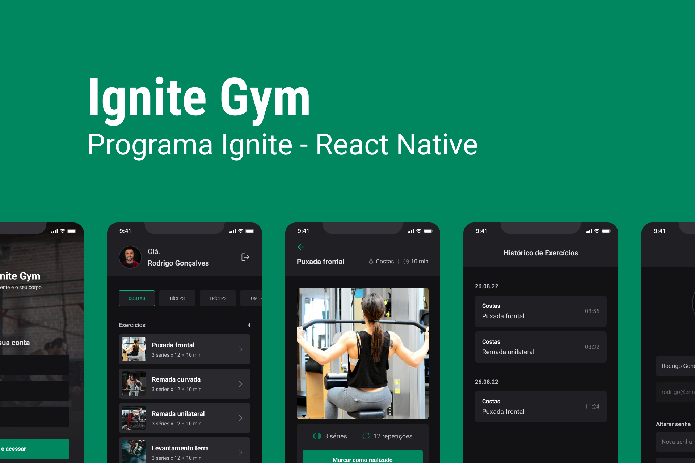

<h1 align="center">
   Ignite Gym 
</h1> 

<div align="center">
   
</div> 

---

O Ignite Gym é uma aplicação para você gerenciar seus treinos na academia e ter mais controle sobre os exercícios que está realizando. A Aplicação consome um back-end em Node.js que contém uma variedade de exercícios divididos em grupos (ombro, tríceps, bíceps, costas, etc.). Após realizar o exercício, basta marcar como realizado que ele será enviado ao seu relatório, onde ficará salvos todos seus exercícios já feitos, separados por dia e hora.


## 💻Tecnologias Utilizadas

### Mobile

- [x] [React Native](https://reactnative.dev/)
- [x] [Expo](https://docs.expo.dev/)
- [x] [TypeScript](https://www.typescriptlang.org/)
- [x] [Gluestack UI](https://gluestack.io/ui/docs/home/getting-started/installation)
- [x] [React Navigation - Native Stack and Bottom Tabs](https://reactnavigation.org/)
- [x] [Axios](https://axios-http.com/ptbr/)
- [x] [Expo ImagePicker](https://docs.expo.dev/versions/latest/sdk/imagepicker/)
- [x] [Expo FileSystem](https://docs.expo.dev/versions/latest/sdk/filesystem/)
- [x] [React Hook Form](https://react-hook-form.com/)
- [x] [Yup](https://github.com/jquense/yup)
- [x] [AsyncStorage](https://docs.expo.dev/versions/latest/sdk/async-storage/)

## ✨Pré-requisitos

Antes de começar, certifique-se de ter instalado as seguintes ferramentas:

- [Node.js](https://nodejs.org/)
- [Expo CLI](https://docs.expo.dev/get-started/installation/)

## ❓Como executar o projeto

Clone o projeto para o local desejado em seu computador.

```bash
$ git clone git@github.com:c4mpos-dev/ignite-gym.git
```
___

#### 🚧 Executando o Back-end
```bash

# Navegue até o diretório
$ cd api

# Instale as dependências necessárias
$ npm install

# Agora inicie o servidor do back-end
$ npm run start

# O servidor irá rodar na porta 3333 com o aviso: "Server is running on Port 3333".

```
___

#### 🚧 Executando o Front-end
```bash

# Com o back-end rodando, abra um novo terminal e navegue até o diretório
$ cd mobile

# Instale as dependências necessárias
$ npm install

# Agora inicie a aplicação - Um QR Code será exibido no Terminal
$ npm run start

# Eu seu celular instale o aplicativo Expo Go - Ele é gratuito na PlayStore.

# Abra o Expo Go que acabou de instalar, e então escaneie o QR Code através do aplicativo.

# A aplicação então será exibida de forma 100% funcional diretamente em seu celular.

```

## 🏛️Estrutura do Projeto

- **api/**: Contém a api que alimenta o aplicativo.
- **mobile/src/**: Contém o código-fonte do aplicativo.
- **mobile/assets/**: Imagens e outros recursos estáticos.
- **mobile/App.tsx**: Ponto de entrada principal do aplicativo.
- **templates/**: Contém fotos para o README do projeto.

## 🔖 Layout
- [Ignite Gym - Figma](https://www.figma.com/community/file/1163926136397847279)
